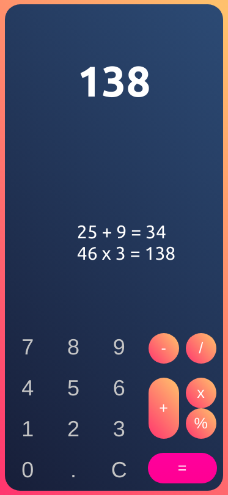

# Simple calculator with TypeScript

I just started learning TypeScript, so this project was meant to practice my knowledge about it.

I want to get back to it again to try to figure out how to deal with Event types and other things TypeScript made me think about.

